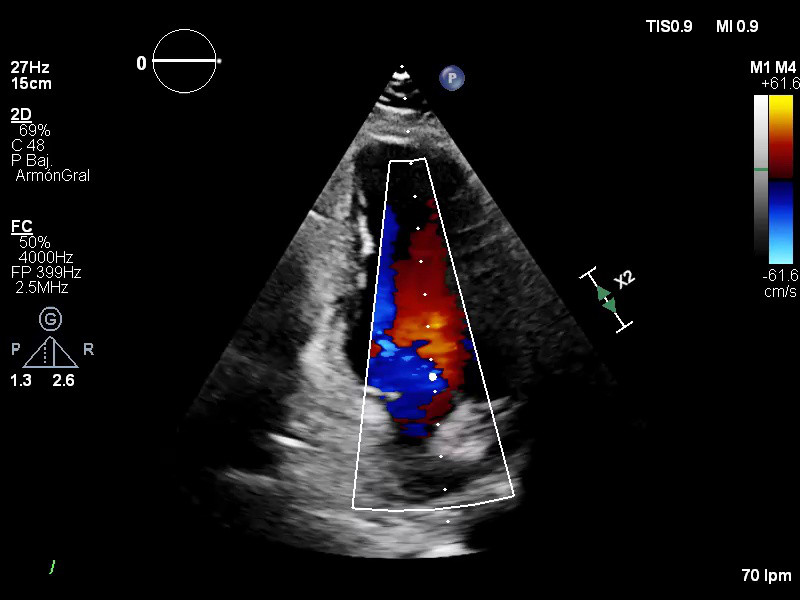
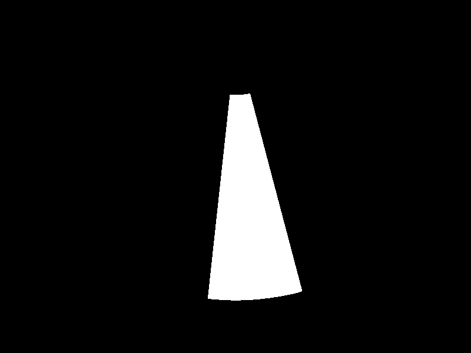

# Volumetric Segmentation of Color Doppler Samples

This repository implements a U-Net based pipeline to segment and generate masks from volumetric Color Doppler imaging data:

<div align="center">
  
  <span>→</span>
  
</div>

> [!NOTE]
> To see the latest updates and upcoming features, please check the [Change Log](./CHANGELOG.md).

## Quick Start
For [uv](https://docs.astral.sh/uv/) users (recommended):

```bash
git clone https://github.com/serchugar/color-doppler-volume-sample-extractor

# In your uv project, install in editable mode with CUDA support (Nvidia GPU)
uv pip install -e "/path/to/color-doppler-volume-sample-extractor[cuda]"

# Or install in editable mode with CPU support
uv pip install -e "/path/to/color-doppler-volume-sample-extractor[cpu]"
```

Alternatively, if using standard Python and pip:

```bash
git clone https://github.com/serchugar/color-doppler-volume-sample-extractor

# Install with CUDA support
pip install -e "/path/to/color-doppler-volume-sample-extractor[cuda]"

# Or install with CPU support
pip install -e "/path/to/color-doppler-volume-sample-extractor[cpu]"
```

## Training Workflow
If you want to skip training and use a pre-trained model, you can download the weights from the [latest release](https://github.com/serchugar/color-doppler-volume-sample-extractor/releases/latest).

### 1. Prepare Your Data
Organize your training images and masks in a directory with the following naming convention:
- Images: `img<number>.jpg` (e.g., `img1.jpg`, `img2.jpg`, `img123.jpg`)
- Masks: `mask<number>.png` (e.g., `mask1.png`, `mask2.png`, `mask123.png`)

> [!IMPORTANT]
> The number in the filename must match between corresponding image and mask files (e.g., `img42.jpg` should have a corresponding `mask42.png`). This naming convention is required for the pipeline to correctly associate images with their segmentation masks.
>
> Mask images must be **binary images without antialiasing** and saved as PNG files to preserve lossless compression.

### 2. Run Training
```python
import random
from pathlib import Path

from dv_extractor import DEVICE, DynamicUNet, train
from dv_extractor.utils import seed_all

# Not mandatory, but recommended for reproducibility
seed = random.getrandbits(32)
seed_all(seed)
print(f"Seed: {seed}")

model = DynamicUNet(in_channels=1, out_channels=1, depth=4, init_features=32)
model.to(DEVICE)
print(f"Model device: {model.device}\n")

labeled_data_dir = Path("path/to/your/labeled/data/dir")
train(
    model,
    labeled_data_dir,
    epochs=100,
    lr=0.001,
    batch_size=5,
    checkpoints_dir=Path("weights"),
)
```

The trained model weights will be saved in the `checkpoints_dir` folder.

> [!NOTE]
> Due to the lack of data, and the time cost of creating each mask, the training does not run a validation process.

## Inference
To run predictions, first train your model or load pretrained weights, then use the `predict()` method from the `DynamicUNet` class.

> [!WARNING]
> The current pretrained weights were trained on images after applying a 95% threshold.  
> Loading "raw" images directly into the model without this thresholding will result in incorrect segmentations.  
> The `predict()` method handles this automatically, use it to avoid any issues. 
> To change the threshold, modify it when creating the model instance, in its constructor.

```python
from pathlib import Path

import torch
from dv_extractor import DEVICE, DynamicUNet, discover_images, visualize_predictions
from torchvision.io import decode_image

# Initialize model with the correct hyperparameters
model = DynamicUNet(in_channels=1, out_channels=1, depth=4, init_features=32)
model.to(DEVICE)

# Load the weights. Here we use the pretrained ones
weights_path = Path("weights/pretrained/unet_depth4_feat32_in1_out1_weights.pt")
state_dict = torch.load(weights_path, map_location=model.device, weights_only=True)
model.load_state_dict(state_dict)

# Load the images 
imgs_path: list[Path] = discover_images(Path("path/to/your/images"))

# Run the inference and visualize the results
masks: list[torch.Tensor] = model.predict(imgs_path)
visualize_predictions(imgs_path, masks, metadata=True)
```

### Pretrained Model Configuration
The following hyperparameters were used to generate the weights available in the [latest release](https://github.com/serchugar/color-doppler-volume-sample-extractor/releases/latest). You can use these as a reference for your own training:

| Parameter | Value | Description |
| :--- | :--- | :--- |
| **Architecture** | U-Net | Base model structure |
| **Depth** | 4 | Number of downsampling/upsampling blocks |
| **Init Features** | 32 | Number of filters in the first layer |
| **Input Size** | 512 x 512 | Spatial resolution of the samples |
| **Threshold** | 0.95 | Doppler intensity cutoff during preprocessing |
| **Learning Rate** | 0.001 | Optimizer step size (Adam) |
| **Epochs** | 2000 | Total training iterations |
| **Batch Size** | 5 | Number of samples per training step |

## GPU Acceleration
To enable CUDA support for faster training and inference, ensure you have [CUDA](https://developer.nvidia.com/cuda-downloads) and [CUDNN](https://developer.nvidia.com/cudnn-downloads) installed.  

Then, sync the environment with the `cuda` extra:

```bash
uv sync --extra cuda
```

In your code, don't forget to move your model and weights to the GPU:

```python
from pathlib import Path

import torch
from dv_extractor import DEVICE, DynamicUNet


model = DynamicUNet(in_channels=1, out_channels=1, depth=4, init_features=32)
model.to(DEVICE)

state_dict = torch.load(Path("path/to/your/weights.pt"), map_location=model.device, weights_only=True)
...
```

`DEVICE` is just a utility constant defined as:
```python
DEVICE: torch.device = torch.device("cuda" if torch.cuda.is_available() else "cpu")
```